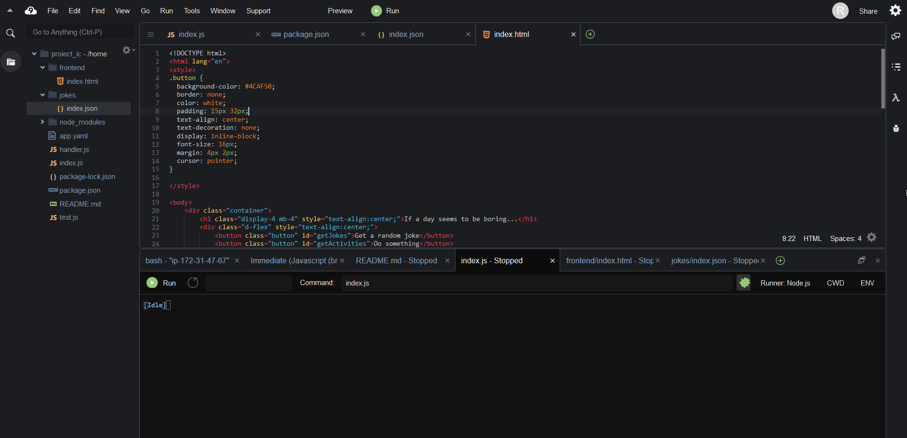

Proiect Cloud

Introducere

Acest proiect a fost realizat in cadrul materiei de Cloud Computing desfasurata prin programul de masterat SIMPRE al facultatii de Cibernetica, Statistica si Informatica Economica. Acesta a avut ca scop intelegerea conceptelor de baza ale serviciilor de Cloud, trimiterea datelor din Cloud catre/dinspre client si folosirea acestora intr-o aplicatie web publica.

Descrierea problemei

Am ales sa creez o aplicatie care poata fi accesata de utilizator prin intermediul unei pagini web, unde acesta poate gasi informatii atunci cand doreste sa se relaxeze. Poate gasi aici o baza de date cu glume din diferite categorii si o baza de date cu activitati.
  
Descriere API

Pentru a realiza aceasta aplicatie, s-au utilizat doua API-uri publice. Le voi mentiona si descrie pe rand:
	
1.	Jokes – „Programming and general jokes”
Acest API este unul public, fara metoda de autentificare. Datele sunt in format JSON si pot fi selectionate in functie de informatiile necesare. Acest API are disponibile mai multe endpoint-uri prin care poate fi accesat. Eu l-am ales pe cel „random” care genereaza o gluma la intamplare, dintr-o anumita categorie. Campurile disponibile prin acest endpoint sunt:
•	ID
•	Type
•	Setup
•	Punchline
Pentru acest proiect, am folosit 3 campuri, excluzand ID-ul, el nefiind relevant pentru utilizator.
Baza de date cu toate glumele disponibila este de fapt reprezentata de fisierul index.json, unde datele sunt salvate in felul urmator:
  {
    "id": 1,
    "type": "general",
    "setup": "What did the fish say when it hit the wall?",
    "punchline": "Dam."
  },

2.	Bored – „Find random activities to fight boredom”
Acest API este de asemenea unul public, fara metoda de autentificare. Are disponibile un singur endpoint, pe care este prezentata o activitate aleatoare. Campurile disponibile sunt:

•Activity
•Accesibility
•Type
•Participants
•Price
•Link
•Key

Pentru acest proiect, am folosit 3 campurile Activity, Type, Participants si Price.
Datele sunt salvate in fisierul activities.json si sunt descrise sub structura urmatoare:
{
"activity":"Improve your touch typing",
"accessibility":0.8,
"type":"busywork",
"participants":1,
"price":"",
"link":"https://en.wikipedia.org/wiki/Touch_typing",
"key":"2526437"
}

Flux de date

In cadrul acestui proiect, datele urmeaza urmatorul flux: datele sunt in format JSON in  fisierele stocate si publicate de catre cele 2 API-uri predefinite si utilizate, acestea sunt accesate prin endpoint-urile disponibile ale API-urilor. Mai departe, in cadrul aplicatiei mele, datele sunt apelate si manipulate in fisierul index.html, ca in final, utilizatorul sa poata accesa public datele printr-o metoda HTTP catre URL-ul ce va face trimitere catre pagina in format HTML.
  
Capturi de ecran

Referințe

